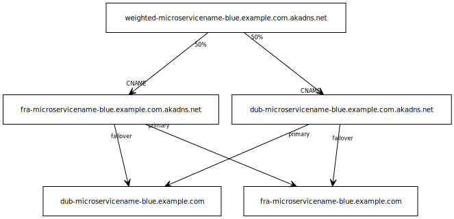

# Akamai GTM Provider Example
GTM is a recent addition to Terraform so I thought I'd try it out with a real customer use-case. I have a customer who have recently started to use microservices to provide functionality for parts of their site. They achieve this with a combination of Phased Release Cloudlet for blue/green deployments, Property Manager for session mapping and datacentre stickiness, and GTM for load balancing and failover. I intend to write other blog articles in future to describe how the various parts of this work but for this article, I'll stick purely to the GTM part.

 

## The Architecture
The customer's microservices solution uses GTM for load balancing across 2 AWS regions in Frankfurt and Dublin, and provides failover between the two datacentres should one of them fail. There will be a GTM endpoint for each deployment instance (blue/green) and each microservice, in each datacentre. Initially, new end users will be load balanced but once they have a sticky cookie, they will be served direct from the datacentre failover property.



## The Problem
I think this is a pretty common model. It does, however, mean that we have lots of GTM properties to create - 2 weighted load balance properties (one each for blue and green) and 4 failover properties (one each for blue/green in each datacentre). We also have 4 origin DNS records but that's outside of the scope of this blog. All this is then multiplied by the number of microservices we have. It's not hard to see how the number of GTM entries could soon become unmanageable when doing this by hand.

## The Solution: Reusable Modules
Luckily Terraform makes this easy by describing and utilizing common functions as Terraform Modules. Our directory hierarchy for our solution will ultimately look like this:-

```
├── main.tf
├── microservices
│   ├── testingapp
│   │   └── main.tf
│   └── testingapp2
│   └── main.tf
├── misc
│   └── import.sh
├── modules
│   ├── dns.tf
│   ├── gtm.tf
│   └── variables.tf
└── terraform.tfstate
```

Each environment shares some resources so we can describe those in our Terraform module in "/modules/gtm.tf".

 
Our domain
```
resource "akamai_gtm_domain" "iancass_co_uk_akadns_net" {
    contract = var.contractid
    group = var.groupid
    comment =  ""
    name = "iancass.co.uk.akadns.net"
    type = "weighted"
    email_notification_list = ["icass@akamai.com"]
    default_timeout_penalty = 25
    load_imbalance_percentage = 10
    default_error_penalty = 75
    cname_coalescing_enabled = false
    load_feedback = false
    end_user_mapping_enabled = false
}
``` 

Our data centres
```
resource "akamai_gtm_datacenter" "Frankfurt" {
    domain = akamai_gtm_domain.iancass_co_uk_akadns_net.name
    city = "Frankfurt am Main"
    cloud_server_host_header_override = false
    cloud_server_targeting = false
    country = "DE"
    latitude = 50.11088
    longitude = 8.67949
    nickname = "Frankfurt"
    state_or_province = "Hessen"
    depends_on = [
        akamai_gtm_domain.iancass_co_uk_akadns_net
    ]
}

resource "akamai_gtm_datacenter" "Dublin" {
    domain = akamai_gtm_domain.iancass_co_uk_akadns_net.name
    city = "Dublin"
    cloud_server_host_header_override = false
    cloud_server_targeting = false
    country = "IE"
    latitude = 53.3441
    longitude = -6.26749
    nickname = "Dublin"
    state_or_province = "County Dublin"
    depends_on = [
        akamai_gtm_domain.iancass_co_uk_akadns_net,
        akamai_gtm_datacenter.Frankfurt
    ]
}
```
Note the use of "depends_on" to absolutely define the order in which things will be created. This is to avoid any potential issues with GTM API and concurrency.

Our failover endpoints - one each for Frankfurt and Dublin. Note, there's only one shown here.
```
resource "akamai_gtm_property" "fra-microapp" {

    for_each = toset(var.deployments)

    domain = akamai_gtm_domain.iancass_co_uk_akadns_net.name
    name = "${var.environment}fra-${var.microservice}-${each.key}"
    type = "failover"
    ipv6 = false
    score_aggregation_type = "worst"
    stickiness_bonus_percentage = 0
    stickiness_bonus_constant = 0
    use_computed_targets = false
    balance_by_download_score = false
    dynamic_ttl = 30
    handout_limit = 8
    handout_mode = "normal"
    failover_delay = 0
    failback_delay = 0
    ghost_demand_reporting = false
    comments = ""
    traffic_target {
        datacenter_id = akamai_gtm_datacenter.Frankfurt.datacenter_id
        enabled = true
        weight = 1
        servers = ["${cloudflare_record.fra[each.key].hostname}"]
    }
    traffic_target {
        datacenter_id = akamai_gtm_datacenter.Dublin.datacenter_id
        enabled = true
        weight = 0
        servers = ["${cloudflare_record.dub[each.key].hostname}"]
    }
    liveness_test {
        name  = "Liveness test - /en/health/health-do-not-touch"
        peer_certificate_verification = true
        test_interval = 60
        test_object  = "/en/health/health-do-not-touch"
        http_header {
                name = "Host"
                value = "www.wheep.co.uk"
        }
        http_error3xx = true
        http_error4xx = true
        http_error5xx = true
        disabled = false
        test_object_protocol  = "HTTPS"
        test_object_port = 443
        disable_nonstandard_port_warning = false
        test_timeout = 25
        answers_required = false
        recursion_requested = false
    }
    depends_on = [
        akamai_gtm_domain.iancass_co_uk_akadns_net,
        akamai_gtm_datacenter.Dublin
    ]
}
``` 

Note, I'm using a 2 element array "var.deployments" to specify blue and green. This is to reduce the amount of duplicated config because the 2 environments are configured identically except for the name. Also note the use of variables to denote the microservice name. 

Lastly, we have a weighted load balance definition that utilizes the 2 failover endpoints that we specified above.

```
resource "akamai_gtm_property" "weighted-microapp" {

    for_each = toset(var.deployments)

    domain = akamai_gtm_domain.iancass_co_uk_akadns_net.name
    name = "${var.environment}weighted-${var.microservice}-${each.key}"
    type = "weighted-round-robin"
    ipv6 = false
    score_aggregation_type = "worst"
    stickiness_bonus_percentage = 0
    stickiness_bonus_constant = 0
    use_computed_targets = false
    balance_by_download_score = false
    dynamic_ttl = 30
    handout_limit = 8
    handout_mode = "normal"
    failover_delay = 0
    failback_delay = 0
    ghost_demand_reporting = false
    traffic_target {
        datacenter_id = akamai_gtm_datacenter.Frankfurt.datacenter_id
        enabled = true
        weight = 50
        servers = []
        handout_cname = "${akamai_gtm_property.fra-microapp[each.key].name}.${akamai_gtm_domain.iancass_co_uk_akadns_net.name}"
    }
    traffic_target {
        datacenter_id = akamai_gtm_datacenter.Dublin.datacenter_id
        enabled = true
        weight = 50
        servers = []
        handout_cname = "${akamai_gtm_property.dub-microapp[each.key].name}.${akamai_gtm_domain.iancass_co_uk_akadns_net.name}"
    }
    depends_on = [
        akamai_gtm_property.fra-microapp,
        akamai_gtm_property.dub-microapp,
        akamai_gtm_domain.iancass_co_uk_akadns_net,
        akamai_gtm_datacenter.Frankfurt,
        akamai_gtm_datacenter.Dublin
    ]
}
```
Our variables are defined in a module level variables.tf

```
variable "microservice" {
}

variable "environment" {
}

variable "deployments" {
        type = list(string)
        default = ["green", "blue"]
}
```
The important thing to note here is that the environment and microservice names are blank in the module. They will be populated once we create something that utilizes the module.

## Microservice Instances
Now that our module is created, we can use it to create instances of the microservices. These are put into their own directory under the "microservices" directory and are incredibly simple. They just provide the variables that we left blank in our module above.

```
module "gtm" {
        source = "../../modules/gtm"
        microservice = "testingapp5"
        environment  = ""
}
```
We then just repeat for each microservice.

## Tie it all together
Now that we've created our microservice definition, we can tie it all together with a top level Terraform config

```
module "testingapp5" {
  source = "./microapps/testingapp5"
}

module "testingapp6" {
  source = "./microapps/testingapp6"
}
``` 

## Running for the first time
Of course, you need to run "terraform init" at top level but before you run your "terraform apply" you need to import common resources into your Terrraform state. The 3 resources that already exist in our example here is the domain itself and each datacentre. The script that I use to do this looks as follows:-

```
for i in `ls microservices`
do
terraform import module.$i.module.gtm.akamai_gtm_domain.iancass_co_uk_akadns_net iancass.co.uk.akadns.net
terraform import module.$i.module.gtm.akamai_gtm_datacenter.Frankfurt iancass.co.uk.akadns.net:3133
terraform import module.$i.module.gtm.akamai_gtm_datacenter.Dublin iancass.co.uk.akadns.net:3134
done
``` 

## Simplifying the Complexities
The configs above do nothing to hide the complexity of GTM configurations but I think that's a good thing. Another level of abstraction would lead to obscurity and hence more complexity in my opinion. Luckily, the development team behind the GTM provider have given us a Terraform-GTM CLI that we can use to generate configuration from existing GTM configuration and to generate our import scripts. You can install this with "akamai install terraform-gtm". I strongly suggest you use this to create a base level configuration that you can then tweak.
